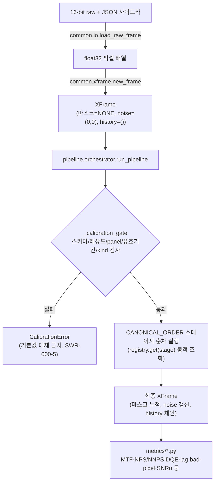

# 데이터 흐름

전체 아키텍처는 [overview.md](./overview.md), 호출 경로는 [entry-points.md](./entry-points.md) 참조.

## End-to-end 흐름 (단일 프레임 기준)

1. **raw 로드**: `common.io.load_raw_frame`이 헤더 없는 16-bit raw + JSON 사이드카 메타데이터를 읽어 float32 배열로 변환한다. 유일한 raw 진입점.
2. **XFrame 구성**: `common.xframe.new_frame`(유일한 생성자, @MX:ANCHOR)이 pixel(float32) + 빈 마스크 스택(`MaskFlag.NONE`) + 초기 `NoiseModel(alpha=0, sigma=0)` + 빈 이력 체인으로 `XFrame`을 조립한다.
3. **오케스트레이터 조합**: 호출자(GUI `pipeline_panel`, 테스트 하네스, `run_sequence`/`run_tier`)가 `registry`, `PipelineDefinition`, `calib_map`, `params_map`을 조립해 `pipeline.orchestrator.run_pipeline`을 호출한다.
4. **`_calibration_gate` 진입 게이트**: 각 스테이지 실행 직전, 해당 스테이지에 대응하는 `CalibSet`이 존재하는지, 스키마·해상도·panel_id·유효기간이 일치하는지, `kind`가 `_KIND_BY_STAGE`에 정의된 스테이지와 배선이 맞는지 검사한다. 캘리브레이션 부재 시 기본값으로 무단 대체하지 않고 `CalibrationError`를 발생시킨다(SWR-000-5).
5. **CANONICAL_ORDER 스테이지 순차 실행**: 게이트를 통과한 스테이지만, 아래 정의된 정준 순서의 부분수열로 `registry.get(stage)`가 반환한 처리 함수를 통해 실행된다. 매 스테이지가 `XFrame`을 입력받아 새 `XFrame`을 반환(불변, `dataclasses.replace` 기반)한다.
6. **지표 산출**: 처리된(또는 원본) `XFrame`을 `metrics/*.py`의 엔진(MTF, NPS/NNPS, DQE, lag, bad-pixel, SNRn, duplex wire 등)에 입력해 `MetricResult`를 얻는다. 지표 산출은 파이프라인 스테이지가 아니라 별도 오프라인/온디맨드 호출이다.



## CANONICAL_ORDER 스테이지 체인

```
offset → gain → defect → lag → line_noise → saturation → geometry → grid → virtual_grid → denoise → mse → window → post
```

`PipelineDefinition.stages`는 이 정준 순서의 **부분수열(subsequence)**만 허용된다 — 순서 위반(`PipelineOrderError`) 또는 중복 스테이지는 즉시 거부된다(ORCH-3). 등록되지 않은 스테이지는 단순 스킵되며 존재하는 스테이지는 상대 순서를 유지한다.

- `grid`(WP8)는 `geometry` 이후, `denoise`/`mse` 이전에 배치된다 — 관측 스펙트럼 피크 탐색은 축 정렬·왜곡보정이 끝난 프레임을 필요로 하며(geometry 이후), BM3D가 주기적 grid 패턴을 반복 텍스처로 오인해 뭉개거나(denoise 이전) mse가 잔여 grid 라인을 대비로 증폭(mse 이전)하는 것을 방지한다. `_KIND_BY_STAGE`에 배선되지 않고 `CalibSet(OTHER)`(빈 placeholder)로 게이트를 통과한다.
- `virtual_grid`(WP9)는 `grid` 이후, `denoise` 이전에 배치된다 — 물리 grid와 가상 grid(SKS 산란보정)는 취득 맥락상 상호 배타적이지만 상대 순서로 저비율 물리 grid의 잔여 산란까지 커버한다. `CalibSet(SCATTER)`(실측 산란커널)로 `_KIND_BY_STAGE`에 배선된다.
- `mse`, `window`는 `denoise`와 `post` 사이의 디스플레이 후처리 전용 스테이지(WP6/WP7)다. 둘 다 `_KIND_BY_STAGE`에 배선되지 않고 `CalibSet(OTHER)`로 게이트를 통과한다.
- `post`는 예약된 꼬리 스테이지(현재 미구현, 향후 확장용).
- 위 스테이지들은 모두 CANONICAL_ORDER의 부분수열로 삽입되었으므로, 이를 등록하지 않는 기존 파이프라인 정의와 하위 호환이다.

## 마스크 스택 전파

`MaskFlag`(IntFlag): `NONE=0`, `DEFECT=1`, `SATURATION=2`, `INTERPOLATION=4`, `SATURATION_BAND=8`.

| 플래그 | 설정 스테이지 | 비고 |
|---|---|---|
| `DEFECT` | `gain`(out-of-range 픽셀), 사전 로드된 defect map | `defect` 스테이지가 소비해 보간 처리 |
| `INTERPOLATION` | `defect` | 결함 보간이 적용된 픽셀 표기 |
| `SATURATION` | 업스트림(획득 시점 또는 이전 스테이지) 마스크, `saturation` 스테이지가 소비 | 값 복원 없음(SWR-602) — 마스크만 관리 |
| `SATURATION_BAND` | `saturation`(팽창 연산) | `SATURATION`과 분리되어 있어 `saturation` 스테이지가 **멱등**(재실행해도 밴드가 누적 팽창하지 않음) |

마스크는 union-forward 방식으로 스테이지를 거치며 누적되고, 어떤 스테이지도 이미 설정된 마스크 비트를 제거하거나 "복원"하지 않는다(포화 영역 복원 금지, SWR-602).

## 노이즈 모델 전파

1. 초기 `XFrame.noise = NoiseModel(alpha=0, sigma=0)` (또는 로더가 설정한 초기값).
2. `denoise`(WP5) 스테이지가 `CalibSet(NOISE)`에서 `(alpha, sigma)`를 조회해 VST(GAT) 파라미터로 사용하고, 처리 후 `XFrame.noise`를 갱신된 노이즈 모델로 기록한다.
3. `mse`(WP6) 스테이지는 `XFrame.noise`를 읽어 노이즈 게이트(밴드별 변조 강도 결정)에 사용한다.

즉 노이즈 모델은 `(0,0)`으로 시작해 `denoise`가 `CalibSet(NOISE)`로부터 값을 채우고, `mse`가 그 결과를 소비하는 단방향 파이프라인 내부 전달 채널이다.

## 이력 체인(History-chain)

모든 `process` 호출은 `XFrame.record_history`(순수 `dataclasses.replace` 기반)를 통해 `HistoryEntry(module_name, module_version, params_hash, calibset_id, extra)`를 이력 튜플에 **append**한다. 이력은 append-only이며 수정·삭제되지 않아 전체 처리 경로에 대한 감사(audit) 추적이 가능하다. `params_hash`는 `common.xframe.hash_params`(정규화 JSON + SHA-256)로 계산되어 동일 파라미터 재현성을 보증한다.

## 오프라인 CalibSet 빌더 → 모듈 소비 매핑

`metrics/` 내 4개 빌더는 파이프라인 실행과 별도로 오프라인에서 `CalibSet`을 생성하며, 이후 해당 CalibSet이 대응 모듈의 `calib_map` 입력으로 사용된다.

| 빌더 (metrics/) | 생성 CalibKind | 소비 모듈 |
|---|---|---|
| `lag_irf.py` | `LAG` | `modules/lag.py` (`LagCorrector`) |
| `defect_map.py` | `DEFECT` | `modules/defect.py` |
| `noise_model.py` | `NOISE` | `modules/denoise.py` (VST/GAT 파라미터) |
| `scatter_kernel.py` | `SCATTER` | `modules/virtual_grid.py` (SKS 산란 감산) |

이 빌더들은 `metrics → common` 계층 규칙을 따르며 `modules`를 import하지 않는다 — CalibSet은 파일(npz+JSON) 또는 in-memory 객체로 전달되는 데이터 계약이지, 코드 의존성이 아니다.
