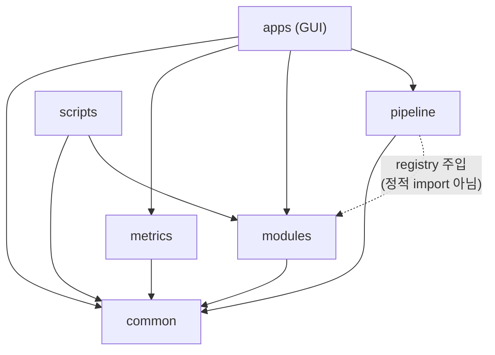

# 의존성 규칙

전체 아키텍처는 [overview.md](./overview.md), 파일별 상세는 [modules.md](./modules.md) 참조.

## 패키지 수준 import 방향

| Importer | Imported | 비고 |
|---|---|---|
| `common` | (없음) | 기반 계층 — 위로 import 금지 |
| `modules` | `common` | 처리 모듈은 서로를 import하지 않음(수평 독립) |
| `pipeline` | `common` | `pipeline.tier`는 `modules`/`metrics` 모두 금지(아래 참조) |
| `metrics` | `common` | |
| `apps` (GUI) | `common`, `metrics`, `modules`, `pipeline` | 4계층의 **단방향 소비자**. 역방향 금지 |
| `scripts` | `common`, `modules` | 골든모델 패키지 외부 도구; import-linter `root_packages` 대상 아님 |

**패키지 수준 순환 의존성 없음.** 모든 화살표는 하향 단방향이며 `common`이 유일한 최하위 기반 계층이다.

## registry/DI 디스패치 — pipeline은 modules를 정적으로 import하지 않는다

`pipeline/orchestrator.py`는 어떤 `modules/*.py`도 직접 import하지 않는다. 대신:

- `run_pipeline(frame, definition, registry, calib_map, params_map=None, ...)` 시그니처에서 `registry: Mapping[str, ProcessCallable]`를 파라미터로 전달받는다.
- 각 스테이지 실행 시 `registry.get(stage)`로 처리 함수를 동적 조회한다.
- 실제 registry 구성은 두 경로 중 하나:
  - `modules.registry.default_registry()` — 전체 스테이지의 기본 `ProcessModule` 매핑을 생성 (lag는 매 호출마다 fresh `LagCorrector()` 인스턴스).
  - 시퀀스별 팩토리(`RegistryFactory = Callable[[], Mapping[str, ProcessCallable]]`, `pipeline/sequence.py`) — 연속 캡처마다 새 registry를 생성해 상태(lag)를 격리.

이 패턴 덕분에 `pipeline` → `modules`는 계층 규칙상 허용되지만, **실제 소스 코드 수준의 정적 import는 `modules/registry.py`에만 존재**한다(모든 모듈을 import하는 유일한 파일). `pipeline.tier`는 이 registry조차 직접 만들지 않고 호출자가 주입한 것을 그대로 전달하므로 `modules`/`metrics` 어느 쪽도 import할 필요가 없다(아래 계약 6).

## import-linter 계약 (`pyproject.toml` `[tool.importlinter]`, `uv run lint-imports`)

`root_packages = ["common", "modules", "pipeline", "metrics", "apps"]`. 총 7개 계약:

| # | 이름 | 타입 | 내용 |
|---|---|---|---|
| 1 | Processing layers | `layers` | `pipeline → modules → common` 하향 단방향 |
| 2 | Metrics layering | `layers` | `metrics → common`, 역방향 금지 |
| 3 | common is foundational | `forbidden` | `common → {modules, pipeline, metrics}` 금지 |
| 4 | Processing modules independence | `independence` | `modules.{offset, gain, defect, lag, line_noise, saturation, geometry, grid, virtual_grid, denoise, mse, window}` 12개 모듈 상호 import 금지 |
| 5 | Modules forbidden upward | `forbidden` | `modules → {metrics, pipeline}` 금지 (module → common만 허용) |
| 6 | Tier gating isolation | `forbidden` | `pipeline.tier → {modules, metrics}` 금지 (registry 주입으로 대체, layers 계약의 틈을 명시적으로 막음) |
| 7 | GUI one-way consumer | `forbidden` | `{common, modules, pipeline, metrics} → apps.gui` 금지 (core는 GUI를 역참조하지 않음) |

계약 7은 `tests/apps/gui/test_tc_viewer_arch.py`의 `tests/fixtures/badgui/` 카나리아로 실효성이 검증된다(위반을 고의로 심어 별도 격리 import-linter 설정이 실제로 실패하는지 확인).

## 요약

- 패키지 간 순환 의존성 없음(정적 검사로 보증).
- `modules/`는 수평적으로 완전히 독립 — 상호 import 시 CI(import-linter)에서 즉시 실패.
- `pipeline`은 오케스트레이션 권한을 가지되 registry DI로 `modules`와 느슨하게 결합되어, 계약 6(`pipeline.tier`)처럼 더 엄격한 격리도 추가로 강제 가능.
- `apps`(GUI)는 4개 핵심 계층 전부를 소비하는 유일한 상위 계층이며, core → GUI 역참조는 계약 7로 원천 차단.
