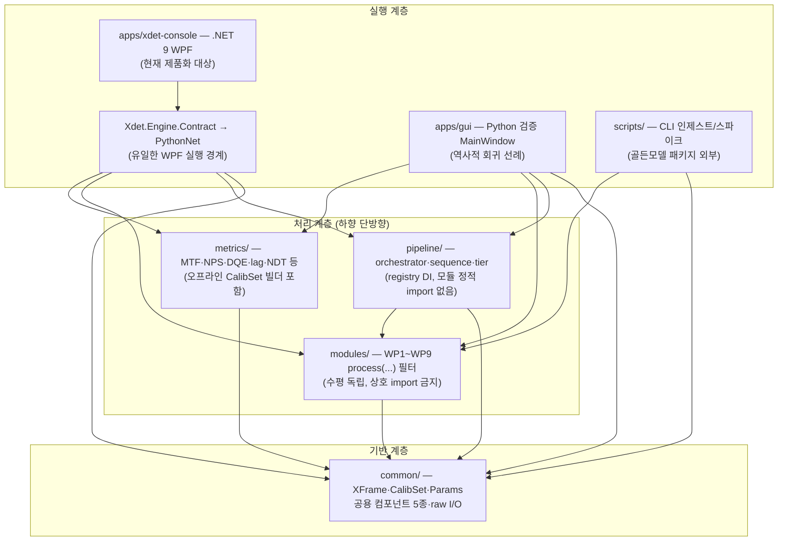

# XDET P1 아키텍처 개요

X-ray FPD(CsI, 140µm, 3072×3072 / 3072×2560, 16-bit raw) 영상처리 SW의 P1(SW 레퍼런스/골든 모델) 구현. numpy/scipy 기반 float 파이프라인으로 정확도가 유일한 목표이며(속도 최적화는 P2), 모든 요구사항은 `docs/XDET_SWR_spec_v1.2.md`(SWR ID)에 대응한다.

## 아키텍처 패턴

**계층형(하향 단방향) pipe-and-filter + 레지스트리/의존성 주입(DI) 오케스트레이션.**

- 처리 모듈(`modules/`)은 서로를 알지 못하는 수평적으로 독립된 필터이며, 모두 `process(XFrame, CalibSet, Params) -> XFrame` 단일 계약을 구현한다.
- 모듈 조합 권한은 오직 오케스트레이터(`pipeline/orchestrator.py`)에 있다. 오케스트레이터는 모듈을 정적 import하지 않고, 호출자가 주입한 `registry: Mapping[str, ProcessCallable]`를 통해 스테이지명→처리함수를 동적으로 조회한다(DI).
- 계층 방향은 `pipeline → modules → common`, `metrics → common`으로 하향 단방향이며, `import-linter`(`pyproject.toml` `[tool.importlinter]`)가 CI에서 기계적으로 강제한다.

## 패키지 구성

| 패키지 | 책임 | 소스 파일 수 |
|---|---|---|
| `common/` | 공용 컴포넌트 5종(pyramid/히스토그램·FOV/FFT·PSD/강건통계/마스크연산) + 코어 데이터모델(XFrame/CalibSet/Params) + raw I/O | 12 |
| `modules/` | WP1~WP9 처리 모듈(`process(...)` 계약 구현) + 기본 레지스트리 | 14 |
| `pipeline/` | 오케스트레이터, 연속캡처 시퀀스, 티어 게이팅 | 4 |
| `metrics/` | MTF/NPS·NNPS/DQE/lag/bad-pixel/NDT 등 지표 산출 엔진 + 오프라인 CalibSet 빌더 | 12 |
| `apps/` | 제품화 `.NET 9 WPF` 앱(`xdet-console`, 현재 14 C# + 2 XAML 수직 슬라이스)과 역사적 Python 검증 GUI(`gui`, 13 Python source) | 29 |
| `scripts/` | 데이터 인제스트/스파이크 CLI 도구 (골든 모델 패키지 외부) | 3 |
| **합계** | | **74** |

패키지별 상세 카탈로그는 [modules.md](./modules.md), 의존성 규칙은 [dependencies.md](./dependencies.md) 참조.

## 핵심 불변식 (CLAUDE.md 아키텍처 강제 규칙, 위반 시 머지 불가)

- **단일 시그니처**: 모든 처리 모듈은 `process(XFrame, CalibSet, Params) -> XFrame`, 순수함수형(사이드이펙트 없음). 유일한 예외는 lag(WP2)의 상태변수 재귀(SWR-000-7, `LagCorrector.process`).
- **XFrame 캡슐화**: pixel(float32) + 마스크 스택(defect/포화/보간) + 노이즈모델(α,σ) + 처리 이력 체인만으로 구성. 사이드채널(추가 반환값, 전역 상태) 금지.
- **모듈 간 직접 호출 금지**: 조합은 오케스트레이터(`pipeline.orchestrator.run_pipeline` 등)만 수행. 모듈은 `common/`만 import.
- **공용 컴포넌트 1회 구현**: pyramid/히스토그램·FOV/FFT·PSD/강건통계/마스크연산 5종은 `common/`에만 존재, 중복 금지.
- **정적 검사**: import-linter 계약(7건)이 계층 방향·모듈 독립성·GUI 단방향 소비를 CI에서 강제.

## 계층 구조

## 관련 문서

- [modules.md](./modules.md) — 패키지별 파일 카탈로그, SWR ID 매핑, @MX:ANCHOR 허브
- [dependencies.md](./dependencies.md) — 패키지 간 import 방향, import-linter 계약 7건, registry DI 상세
- [entry-points.md](./entry-points.md) — GUI/CLI 실행 진입점, 파이프라인 호출 경로
- [data-flow.md](./data-flow.md) — raw 로드부터 지표 산출까지 end-to-end 데이터 흐름
- 상위 참조: `.moai/project/structure.md`, `CLAUDE.md`(작업 우선순위 T0~T10)
